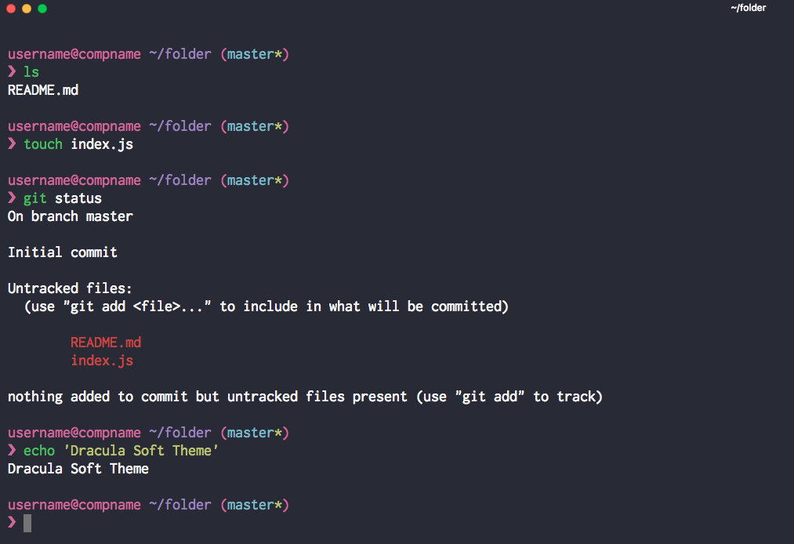

# Soft Dracula for [Hyper](https://hyper.is)

> A spin off of the [Soft Dracula theme](https://draculatheme.com/) for [Hyper](https://hyper.is).

## Install

Add `hyper-dracula-soft` to the plugins list in your ~/.hyper.js config file.

## Special Thanks

[Dracula](https://github.com/dracula/dracula-theme/) is a project created by Zeno Rocha with the help of many awesome contributors and maintainers.

## License

[MIT License](./LICENSE)
